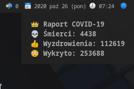
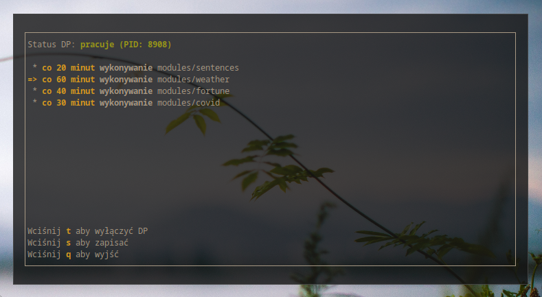
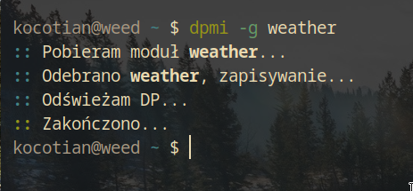
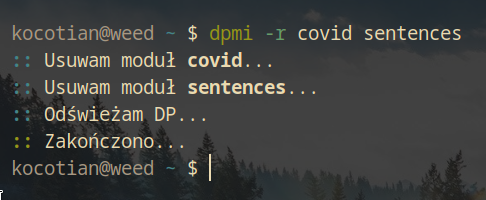

# Don't Panic

Don't Panic to prosty, lekki i modularny daemon działający w tle. Jego głównym zadaniem jest wykonywanie modułów będących najczęściej skryptami powłoki (chociaż mogą być również napisane w dowolnym innym języku programowania) i przekazywanie ich standardowego wyjścia do powiadomień. Moduły najczęściej pobierają i przetwarzają dane z serwera i wypisują je na standardowe wyjście.



Powiadomienie z modułu COVID



dpm - Półgraficzny menadżer dp



Pobieranie modułu przy użyciu dpmi



Usuwanie modułu przy użyciu dpmi

Don't Panic jest jedynie daemonem, do jego obsługi używa się oddzielnych programów niewbudowanych w rdzeń daemona, jak np. "Don't Panic Manager" służący m.in. do konfiguracji odstępów czasowych w jakich będą wykonywane moduły oraz "Don't Panic Module Installer" służący do pobierania i usuwania modułów.
Sprawia to, że daemon podąża Filozofią UNIXa - "Pisz programy które robią jedną rzecz i robią ją dobrze. Rób programy aby pracowały ze sobą. Rób programy które łapią strumienie tekstowe, ponieważ to uniwersalny interfejs".

## Instalacja
Aby zainstalować Don't Panic wraz z programami pomocniczymi służącymi do jego konfiguracji, będziesz potrzebować:
- Systemu operacyjnego Linux (lub innego zgodnego z POSIX.1-2008)
- Dostępu do konta root (lub uprawnień do zapisu w katalogu /usr/local)
- Programu `make`
- Kompilatora `GCC` (lub innego zgodnego z C99)
- `libnotify` do wyświetlania powiadomień

**Uwaga**: Każde polecenie zaczynające się od `#` wymaga uprawnień roota. Aby to wykonać najczęściej należy na początku każdego takiego polecenia wpisać `sudo`

### Instalacja `make` i `gcc`
#### Debian i pochodne (Ubuntu, Mint, elementary...):
```sh
# apt install make gcc
```

#### Arch Linux i pochodne (Artix, ArchBang, Antegros...):
```sh
# pacman -Sy make gcc
```

### Instalacja `libnotify`
#### Debian i pochodne (Ubuntu, Mint, elementary...):
```sh
# apt install libnotify-bin libnotify-dev
```

#### Arch Linux i pochodne (Artix, ArchBang, Antegros...):
```sh
# pacman -Sy libnotify
```

### Kompilacja i instalacja
```sh
$ git clone https://git.kocotian.pl/dp
$ cd dp
$ make all
# sudo make install
```

## Pierwsze uruchomienie
Aby uruchomić daemon należy wpisać
```sh
$ dp
```

## Konfiguracja
Podczas instalacji zostają pobrane 3 moduły - `fortune`, `sentences` oraz `covid`. Wykonują się one w godzinnych odstępach czasowych. Aby zmienić odstępy czasowe, należy uruchomić półgraficzny menadżer daemona:
```sh
# dpm
```
Pozwala on skonfigurować odstępy czasowe lub wyłączyć daemona.

## Dodawanie i usuwanie modułów
Don't Panic przychodzi z programem `dpmi` pozwalającym na dodawanie i usuwanie nowych modułów. Aby zainstalować moduł, należy wpisać:
```sh
# dpmi -g <nazwa modułu>
```
Przykładowo, moduł `weather` nie jest domyślnie instalowany. Aby z kolei usunąć moduł, należy wpisać:
```sh
# dpmi -r <nazwa modułu>
```

## Powiadomienia się nie wyświetlają:
Jeśli powiadomienia się nie wyświetlaja najprawdopodobniej brakuje programu wyświetlającego powiadomienia.
Aby rozwiązać problem, najpierw należy spróbować wpisać komendę odpowiedzialną za wyświetlenie powiadomienia:
```sh
$ notify-send "test"
```
Jeśli komenda nie została znaleziona, należy wykonać ponownie krok polegający na instalacji biblioteki `libnotify`. Jeśli komenda została wykonana pomyślnie, ale nie pokazało się żadne powiadomienie może to oznaczać, że:
- powiadomienia mogą być wyciszone/wyłączone. Należy je wtedy włączyć ponownie w ustawieniach
- brakuje programu odpowiedzialnego za wyświetlanie powiadomień. Poleca się wtedy zainstalować program `dunst`:
	- Debian, Ubuntu...:
	  ```sh
	  # apt install dunst
	  ```
	- Arch, Artix...:
	  ```sh
	  # pacman -Sy dunst
	  ```
	a następnie uruchomić ponownie system. Jeśli powiadomienia nadal się nie pokazują należy wpisać `dunst &`, jest to jednak rozwiązanie tymczasowe służące do sprawdzenia czy wszystko działa poprawnie. Jeśli po wpisaniu `dunst &` powiadomienia się wyświetlają, należy rozważyć dodanie `dunst` do listy programów uruchamianych przy starcie.

Jeśli powiadomienia dalej się nie wyświetlają, nie jest to niestety nasza wina :(, program podczas testów działał bezbłędnie.

## Opcjonalnie: Instalacja lokalna
DP udostępnia plik `config.h` który zawiera różne zmienne konfiguracyjne. Ich zmiana pozwala m.in. na instalację lokalną dla jednego użytkownika. Aby to zrobić należy:
- Otworzyć plik `config.h` i zmienić wszystkie wystąpienia `/usr/local` na np. `/home/jankowalski/.local`, gdzie `jankowalski` jest nazwą użytkownika
- W pliku `Makefile` zmienić zawartość zmiennej `DESTDIR` na docelowy katalog
- Przeprowadzić kompilację i instalację ponownie

## Opcjonalnie: Zmiana systemu wyświetlającego powiadomienia
Aby zmienić system wyświetlający powiadomienia (domyślnie `libnotify`) należy:
- Otworzyć plik `config.h`
- Zmienić `notify-send` na własną komendę pozwalającą wyświetlać powiadomienia
